# LTG-RC-Car


Project for creating a line following car using a PID AI to control the movement, speed, and steering of RC Car. This project uses the Raspberry Pi Zero with brushed DC motors for both steering and forward movement.
<br>
<br>


## Bill of Materials
| Component | Price | Quantity | Description | Part Number/SKU | Link to Buy |
| ----------- | ----------- | ----------- |------------ | ----------- | ---------- |
| SparkFun Autophat | $29.95 | 1 | MotorDriver and IMU sensor | ROB-16328 | [Link to Buy](https://www.sparkfun.com/products/16328)
| Raspberry Pi Zero Wireless WH (Pre-Soldered Header)| $14.95 | 1 | Small computer for internal motor control and user connectivity | 1052 | [Link to Buy](https://www.pishop.us/product/raspberry-pi-zero-wireless-wh-pre-soldered-header/)
| Tracker Sensor Module 5-ch ITR20001/T | $9.99 | 1 | IR sensor array used to track line. Comes with 5 IR sensors pre-soldered.| ITR20001/T | [Link to Buy](https://www.amazon.com/Waveshare-Tracker-Sensor-ITR20001-Infrared/dp/B01MTPEKDC)
| Jada Toys Hyperchargers | $48.20 | 1 | RC Car in which the components will be installed. | 31122 | [Link to Buy](https://www.amazon.com/Jada-Hyperchargers-Chase-Control-Vehicle/dp/B07TYGQDSH/ref=sr_1_10?dchild=1&keywords=hypercharger+jada+rc&qid=1621895405&sr=8-10)
| Camera Module for Raspberry PI | $13.99 | 1 | Camera to sit on hood of car and stream video to user. | B07JXZ93SK | [Link to Buy](https://www.amazon.com/Dorhea-Raspberry-Camera-Adjustable-Focus-Infrared/dp/B07JXZ93SK/ref=sr_1_16?dchild=1&keywords=raspberry+pi+camera&qid=1621895262&sr=8-16)
| JDB Ultra-Slim 5V/2.1A 5000mAh Power Bank | $9.99 | 1 | Power bank for all components of car. | 5K01 | [Link to Buy](https://www.amazon.com/gp/product/B07DQG75MZ/ref=ppx_yo_dt_b_search_asin_title?ie=UTF8&psc=1)
| Short USB C Cable | $6.99 | 1 | Cable to connect the Autophat to the battery bank via USB-C to USB-A.| 2724571560050 |  [Link to Buy](https://www.amazon.com/gp/product/B08LL1SVZD/ref=ppx_yo_dt_b_search_asin_title?ie=UTF8&psc=1)

## Hardware
Much work has done to simplify this process of assembling the car itself. But to start this process, you must first have the car. For this project, we are using a Jada R/C Hypercharger RC car. The pack will come with a police car and red race car. Both cars work the same way, however, the police car has a little more space inside so we will start with that one. However, all elements of this tutorial apply to both.

The Fritzing diagram below lays out the electrical diagram the car will follow. If you are confused by an instruction or image, it is HIGHLY recommended to come back to this guide.

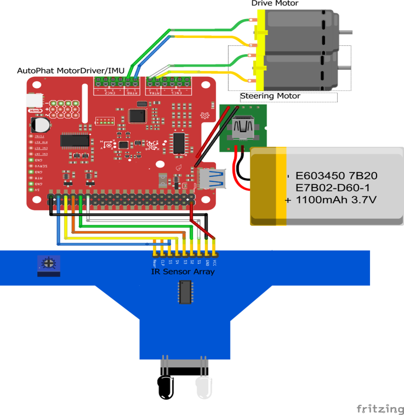

### Required Tools and Materials
For this project, you need, the car, a Raspberry Pi Zero W, a Sparkfun AutoPhat, GPIO connectors and wires, a 5 IR sensor array, hot glue gun, electrical tape, wire cutters, and a phillips screw driver.  Soldering iron is not required but can help secure connections we will make. 

### Prepare the Car
To prepare the car, we will take 4 screws off so we may take the top of the car off. Save these screws for we will need these later when we put the lid back on.


Once the lid is off, we will be gaining access to more of the green, blue, yellow, and gray wires that run from the two motors to the internal of the car. If you intend on restoring the intial use of the car, with the remote that comes in the box, you must keep the red wire that comes out of the chimney like hole intact. You can do this by taking the panel in the middle of the car off with its two screws, putting that wire through the side of the car, and screwing that piece back on. 

We need to cut the yellow, gray, green, and blue wires in a way that allows us to extend them and make them into GPIO connectors. I like to cut them fairly close to the middle of the car allowing most of the wire that runs to the two ends of the car to still be intact. 

### Setup Wires
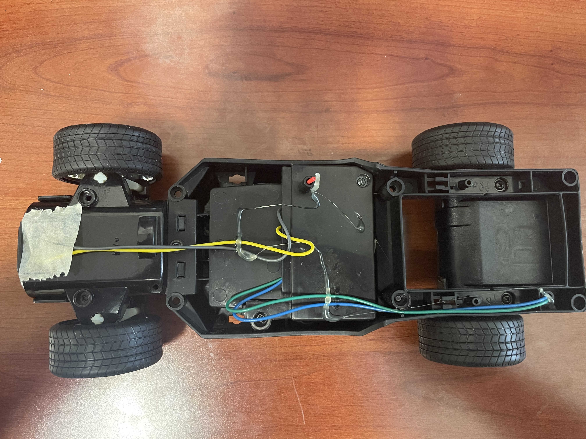

Once this is completed, we need to make these cables both long enough and able to be inserted into the AutoPhat's Pheonix connector. This can be done in a multitude of ways. You can solder these connectors, connect them via GPIO connectors, or simply twist the tips of wires and electrical tape them together. 

Of course, soldering is the best method of securing a connection but all 3 of them will suffice. These cables need to reach 3/4 down the car indicated in the image below. A fair amount of slack is recommended. 

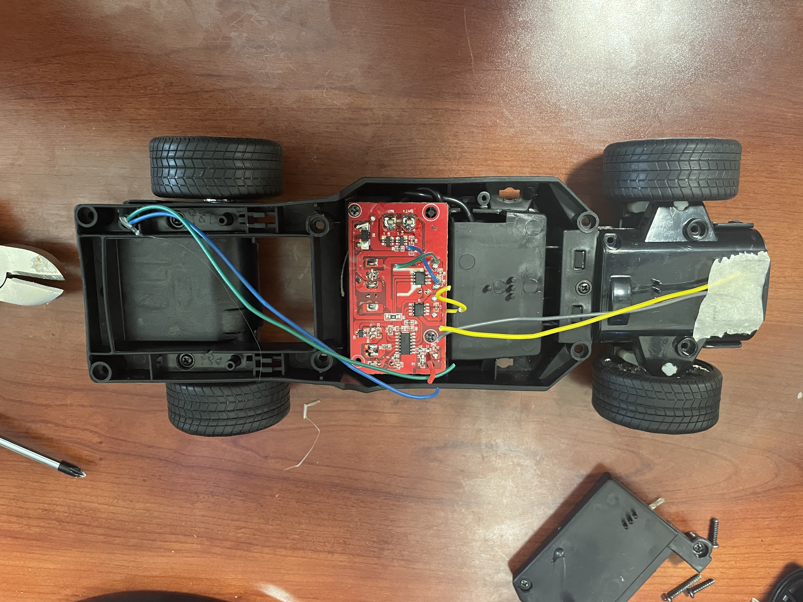

### Gluing Raspberry Pi Zero W
Now lets tackle the Raspberry Pi. Take your hot glue gun and glue the pi in the same spot I did in the image below. The camera connector, the white strip with a gray strip on one of the ends of the pi, on the edge of the inside body of the car. Position shown below.

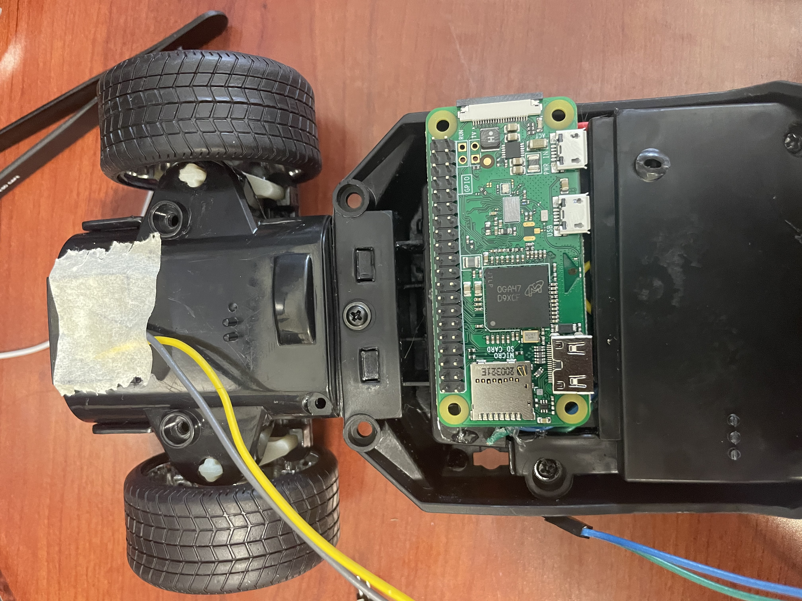

### Attaching IR Sensor Array
We next need to attach the IR sensor array to the bottom front of the car. The position is shown in the image below. It does not have to be exact but you do need to make sure that the wheels are not able to come in contact with this IR array when the wheels are turning. 

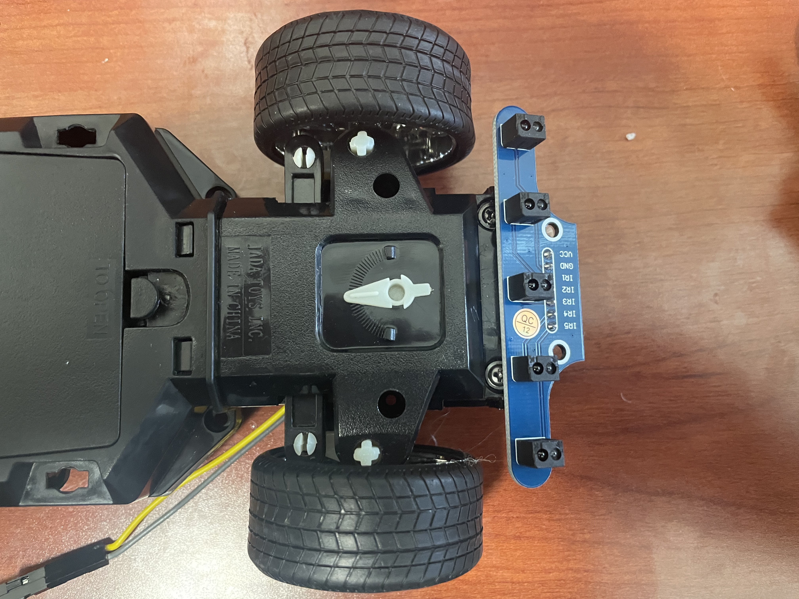

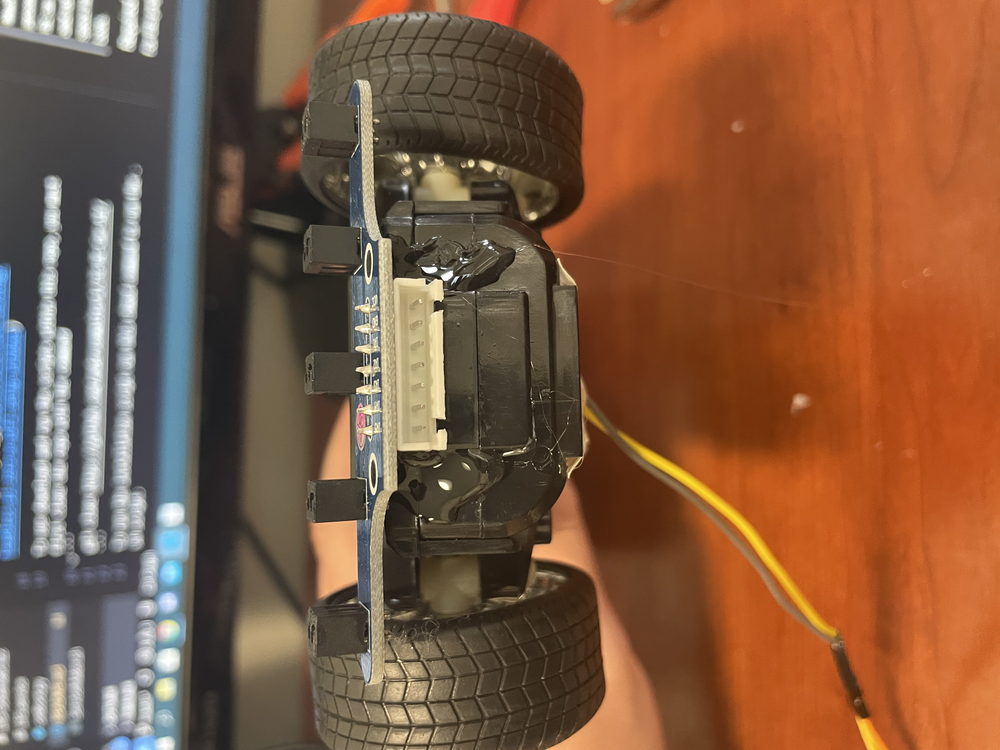

### AutoPhat Configuration
Next, we are going to put the AutoPhat on the top of the Raspberry Pi. The black bar on the bottom of it connects to the GPIO connectors on the Raspberry Pi. Face it so the green or black phenoix connectors are facing the back of the car. In the image below they are black. 

DO NOT hot glue the AutoPhat to anything. It will stay in place by the friction of the GPIO connectors on the Raspberry Pi. 

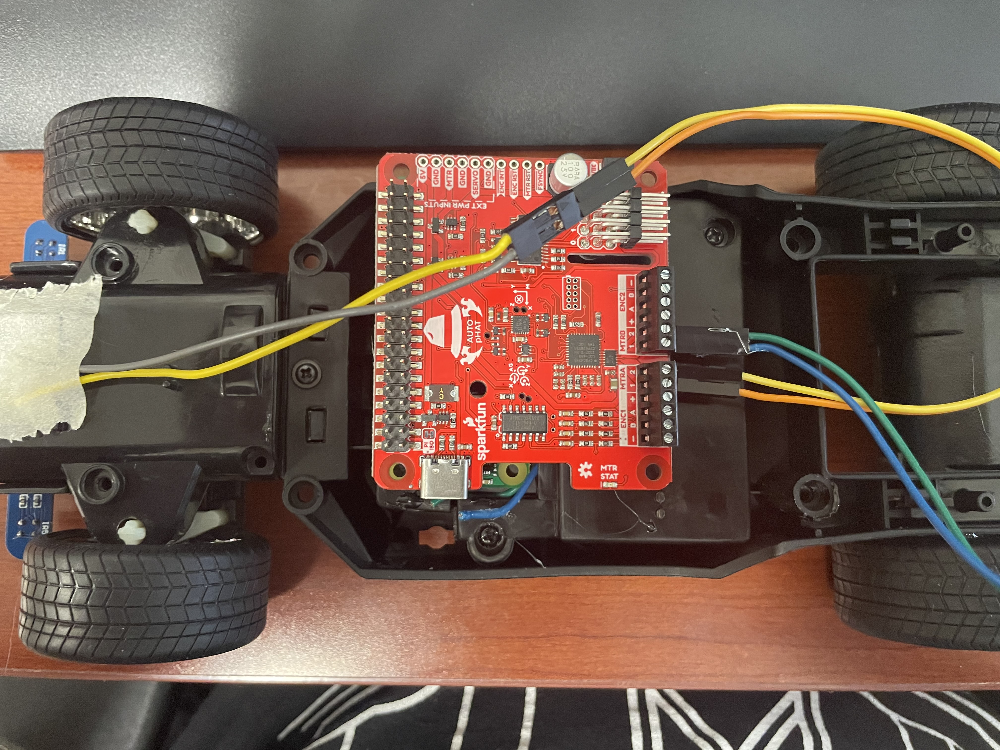

### Pheonix Connectors
Then connect the gray and yellow wires to MTRA1 and MTRA2 respectively. Then connect the blue and green wires to MTRB1 and MTRB2 respectively. To connect the wires to the Pheonix connectors, simply unscrew the top flathead screw until the wire is able to enter in the connector and then tighten it down.

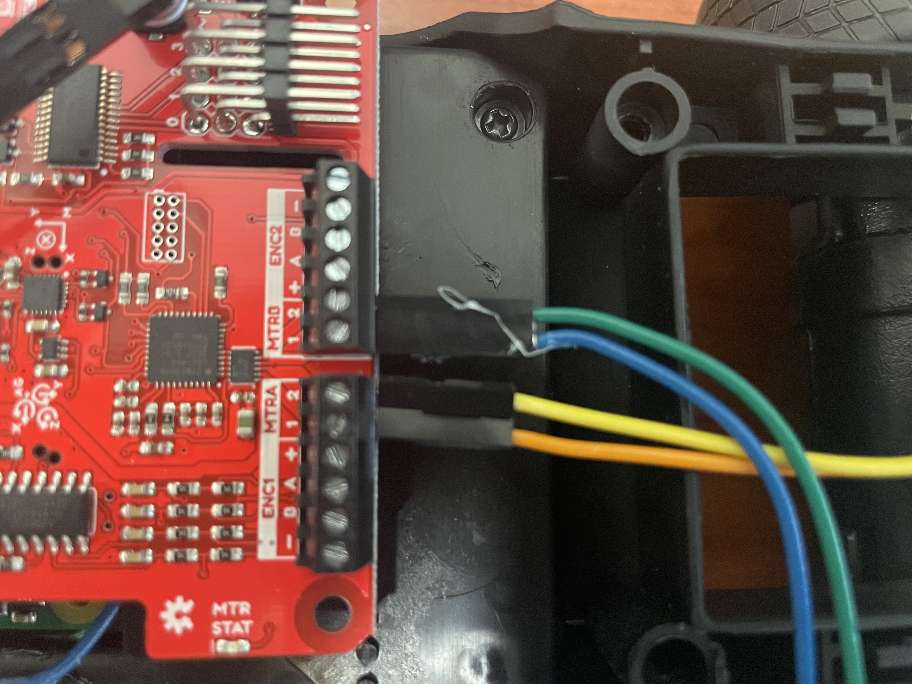

### Connecting GPIO Wires to Raspberry PI
Now connect the IR sensor connector to the IR sensor and run the wires from the front of the car to the Sparkfun Autophat and connect them to the GPIO pins in the electrical diagram above. 

ORDER MATTERS!!!

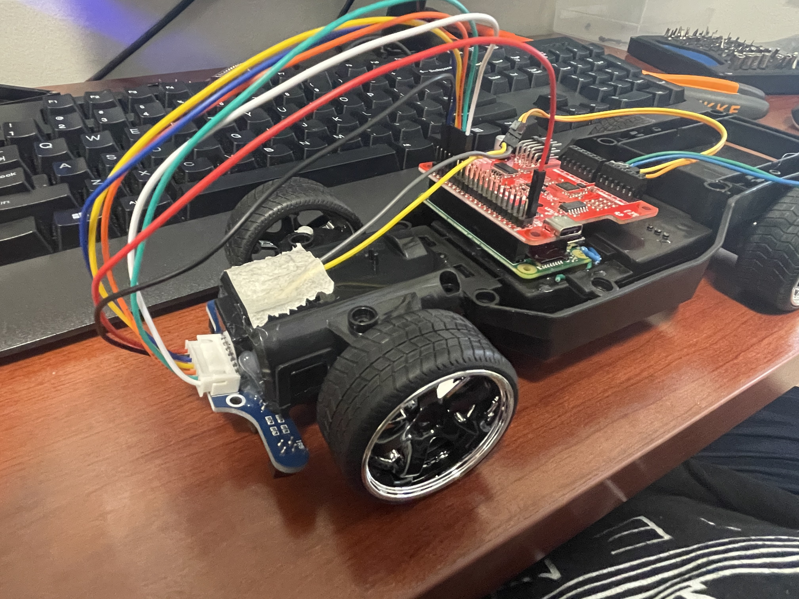

### Outer Body
That is all that needs to be done to the internal of the car. Now get the lid back infront of you along with your hot glue gun. Below are images on how to route the camera wire and the power cable 
which will run from the back of the car. The car is powered by a battery bank which is hot glued to the back of the car. You will run the power cable in between the panels of the outer lid of the car.

This is where you can be creative for aslong as these connectors can make it from camera to camera slot on the Pi, and from the battery bank to the AutoPhats USB C connector, you can connect it how you would like. 

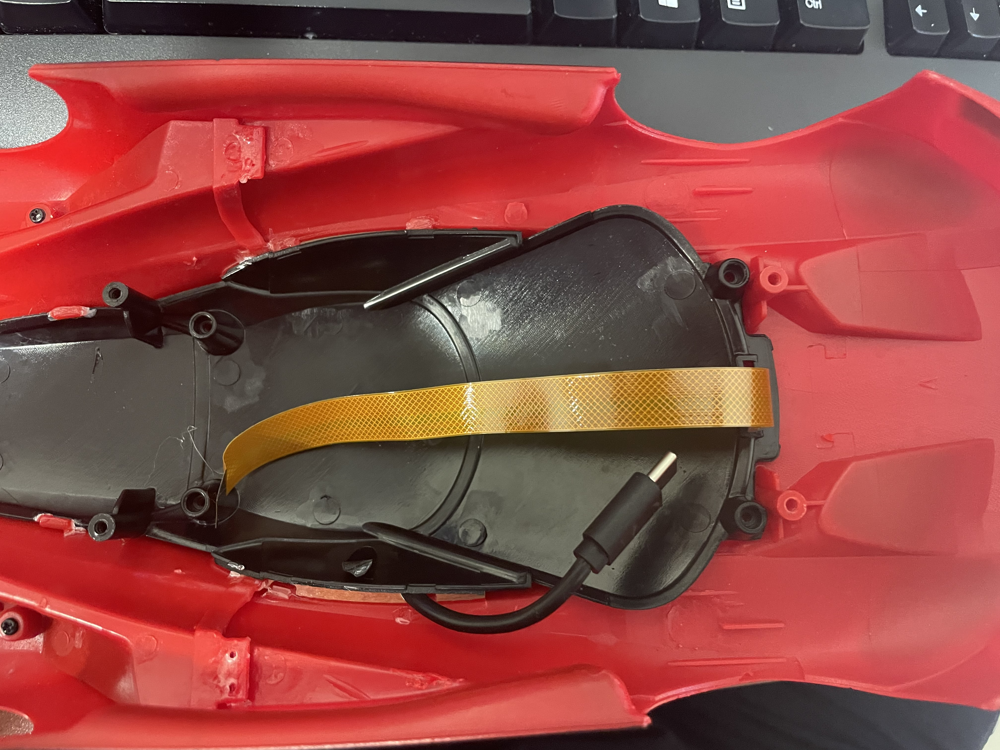

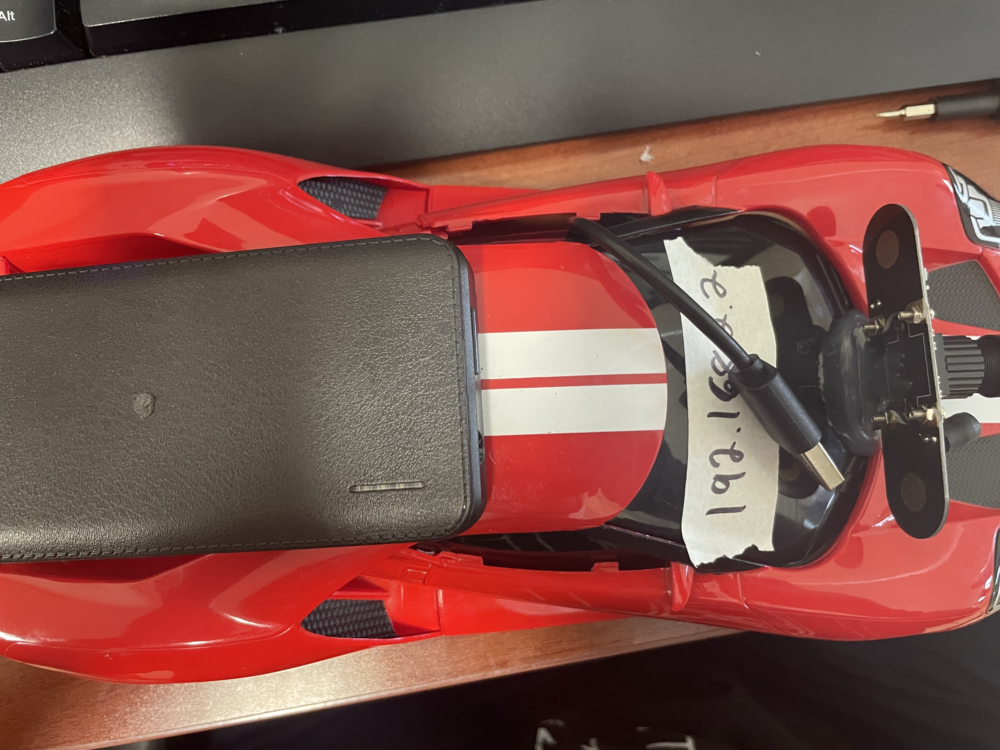

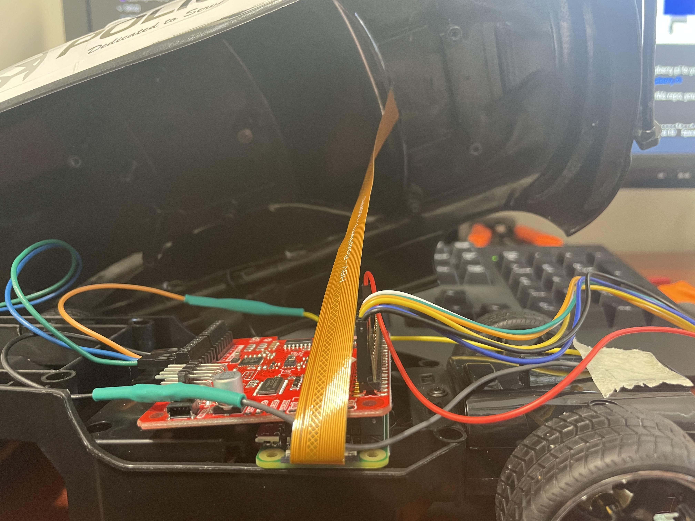

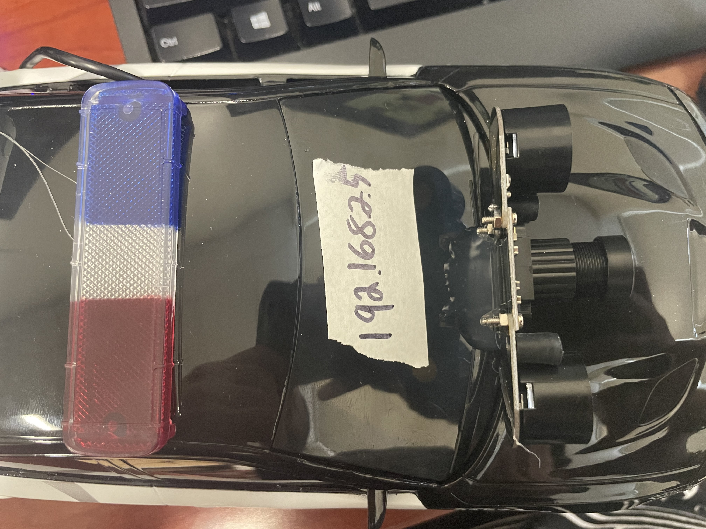

Once you connect those two wires to the internals, you just need the micro sd card with Raspbian to go into the Pi within the car. However, more setup is required to be able to connect to the Raspberry Pi. Below is a complete comprehensive guide to setting the software side of this project up. 

But for now, assuming you have properly setup the micro-sd card, you can insert it into the Pi, and connect the power cable to the battery bank. You will see green flashing lights if the Raspberry Pi is properly booting up. Once you confirmed this, you can put the 4 screws back connecting the lid to the internal car. 
## Software 
### Installing the Software

This project comes with a custom made repo of Rasbian for users to flash to their SD card and get racing right away! 
You must first download the image and then flash it to your sd card with BalenaEtcher which you can download at https://www.balena.io/etcher/
Once the flash is complete, open up notepad and hit space once. Then save this file, however, name the file ssh and click all files in the file type selector. 

Next we need to create our wpf_supplicant.conf file which will allow our Raspberry Pi to connect to our Wifi or hotspot network. 
Open up notepad again and copy and paste the text below. If your network is not listed, add in your network name and password in the open option. 

```
country=US
ctrl_interface=DIR=/var/run/wpa_supplicant GROUP=netdev
update_config=1

network={
    ssid="herocar"
    psk="herocar"
}
network={
    ssid="Name of Network"
    psk="Password of Network"
}
```


## How to run? 
Guess what, the script is already running. All operations that the car requires are now running as a service, which means they run at boot of the pi. If the car cannot be connected to, first check to see if the service named LTG is running with the command below.
```
sudo systemctl status LTG.service
```
If this comes back that is not running, you can re-create the service by running the ServiceMaker.sh script and this will re-create the service. If that fails as well, you can manually run the script for car operations with the command below.
```
python3 LTG-RC-Car\AI_Driver\main.py
```
## Error? What's an Error?

One concept you will hear me talk about a lot in this tutorial is the idea of error. Error is going to refer to how far left or right the car is relative to the middle of the track.
In the simulation in this repo, the cars have 5 trackers on the front of the car that will be looking for where the car is on the track. We will talk about how they do this later in this tutorial. For now, keep in mind that if the car is not in the middle of the track or is swaying to one side of the track, the car will have a higher error. If the car is in the middle of the track, the car will have no error. 

## PID (Proportional-Integral-Derivative) Controller

Control of this car is going to use a PID Controller Model below. The variable "error" will be defined by how far left or right the car is angled relative to the line the car is following. We will be calculating our error with the following logic.

    0 0 0 0 1 ==> Error = 4
    0 0 0 1 1 ==> Error = 3
    0 0 0 1 0 ==> Error = 2
    0 0 1 1 0 ==> Error = 1
    0 0 1 0 0 ==> Error = 0
    0 1 1 0 0 ==> Error = -1
    0 1 0 0 0 ==> Error = -2
    1 1 0 0 0 ==> Error = -3
    1 0 0 0 0 ==> Error = -4

A 1 in this visualization means that that sensor is currently interacting with the box collider that is in the middle of the track. As you can see, 2 trackers can be interacting with that collider at the same time giving us a greater level of accurary when seeing where on the track the car currently is.

The range of motor control we will be using for both steering and forward movement will be within the range of 0-100, where 100 will be the furthest we can turn the car left or right and 0 will have no steering (straight). This range is derived from the motor capability to turn and is standard to this motor type. If we give the motor values outside this range we will
recieve runtime errors from the scripts used to move the car. 

![\Large \alpha _{error} = (J_P\vert_{J_{P=25}}error) - (J_D\vert_{J_{D=0}}\frac{d}{dt}error) - (J_I\vert_{J_{I=0}}\sum_{n=0}^{k\vert_{k=v.len}}v\vert_{v=v[]})](https://latex.codecogs.com/gif.latex?%5CLarge%20%5Calpha%20_%7Berror%7D%20%3D%20%28J_P%5Cvert_%7BJ_%7BP%3D25%7D%7Derror%29%20-%20%28J_D%5Cvert_%7BJ_%7BD%3D0%7D%7D%5Cfrac%7Bd%7D%7Bdt%7Derror%29%20-%20%28J_I%5Cvert_%7BJ_%7BI%3D0%7D%7D%5Csum_%7Bn%3D0%7D%5E%7Bk%5Cvert_%7Bk%3Dv.len%7D%7Dv%5Cvert_%7Bv%3Dv%5B%5D%7D%29)

### P (Proportion)
 <br>
This section of the model will be determining the initial amount of steering to be applied depedent on the amount of error off the line the car is experiencing. We will start with this variable at 25 to account for the 4 errors on each side of the line that can occur. 
### I (Integral)
![\Large (J_I\sum_{n=0}^{k\vert_{k=v.len}}v\vert_{v=v[]})](https://latex.codecogs.com/gif.latex?%28J_I%5Csum_%7Bn%3D0%7D%5E%7Bk%5Cvert_%7Bk%3Dv.len%7D%7Dv%5Cvert_%7Bv%3Dv%5B%5D%7D%29) <br>
This section of the model will take into consideration all of the previous errors and add them up. If the summation of these errors is not 0, then this section will smooth out the correction to get back on the line. For now the constant will be set to 1. We will figure out the best value of this constant later.
### D (Derivative)
 <br>
This portion of the model calculates the delta between the previous error and the current error and then multiply that by the constant which we will figure out in a later step. For now, it will be set to 0. Once implemented, this should reduce the overshoot effect that can happen when the current error greatly deviates from the last error. 

## Tuning PID Controller

Remember! The correct PID tuning is based on many many factors so don't worry if it takes a while!

### Tuning P
To start the tuning of the PID Controller, we will start with the P value. Make sure all other values are set to 0 but J_P. Then slowly increase this value until the car has a steady oscillation. 

### Tuning D
We then will move on to tuning D or the variable J_D. We want to increase this value until those oscillations are dampened to your liking. 

### Tuning I
We will then move to tuning I or the variable J_I. We want to increase this value until the oscillations are very minute and keep the car in a relatively straight position.

## Speed
Speed is the most important value to adjust during the tuning process. The interface allows you to adjust the minimum and maximum speeds. They have a range from 0-200 and if your maximum speed is below your minimum speed, it will automatically make the speed the minimum speed at all times. The car provides more power to the rear motors if the car is turning due to the car having to take on incoming friction with the wheels and their orientation. So the higher the error, the more power the motors will be exerting, resulting in more speed around curves. 
### Tuning Speed
For this, you first want to look at the surface in which the car will be traveling on. If it is a hard surface like a tile or concrete floor, the minimum speed can be much lower than if the surface was foam or carpet. This is because on the harder surfaces, the car has an easier time overcoming intertia at the lower power levels. However, on a foam surface, you need more power all of the time due to the surface constantly providing friction. I recommend starting the max speed at 100 and the minimum speed at 50 and working both closer and closer until you reach an well working speed range. You may need to move the max or min speed up independently in order to find this optimal range. 
### Helpful Tip!
If you cannot find the tuning that you desire, slow the speed of the car down and then try it again! Oscillation patterns are more common at higher speeds.


## Gallery of Cars 


## Authors

* **Anderson Molter** - (https://github.com/andersonmolter1)
* **Sanjay Sarma** - (https://github.com/sanjayovs)
* PI: Prof. Ramviyas Parasuraman - HeRoLab UGA - (http://hero.uga.edu)

