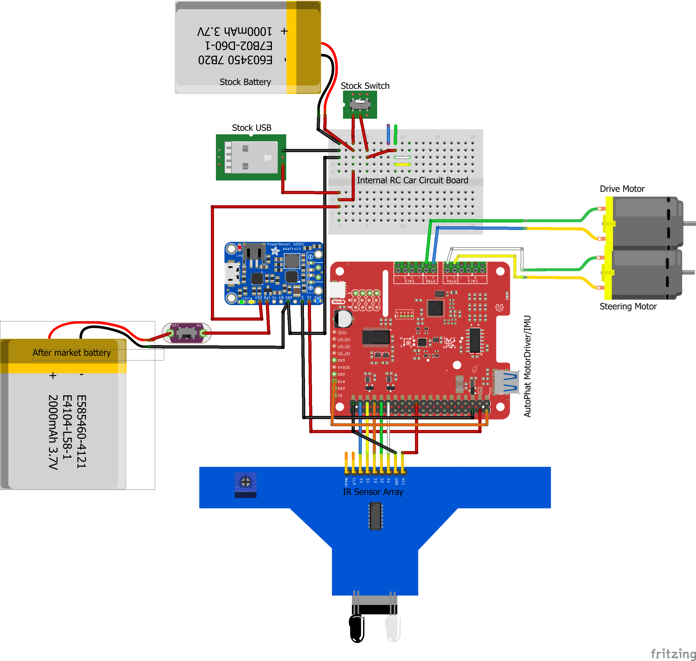
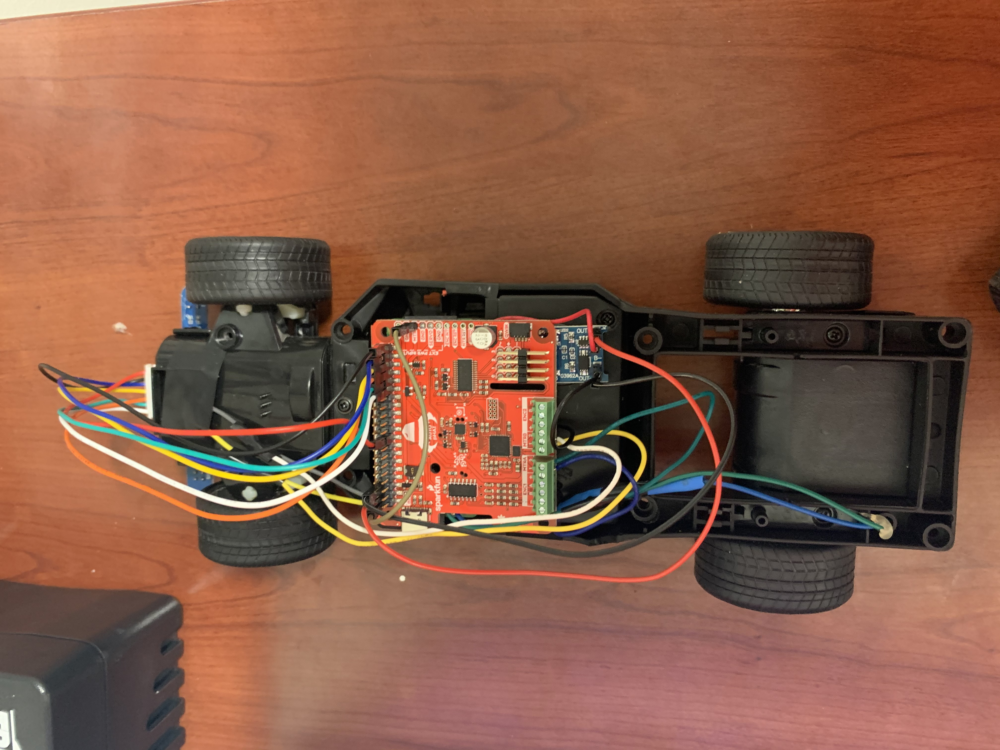
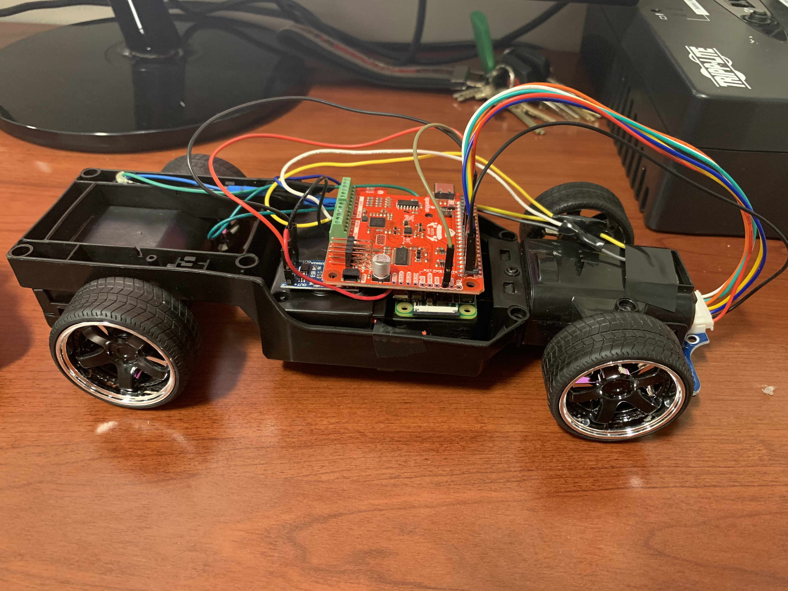
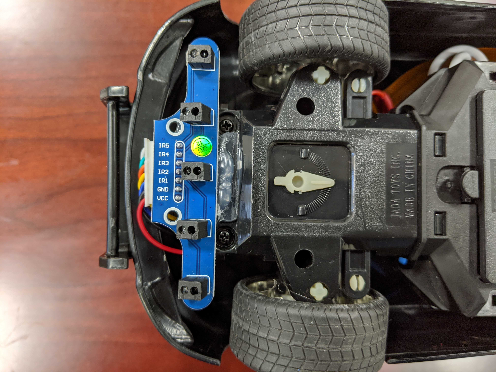
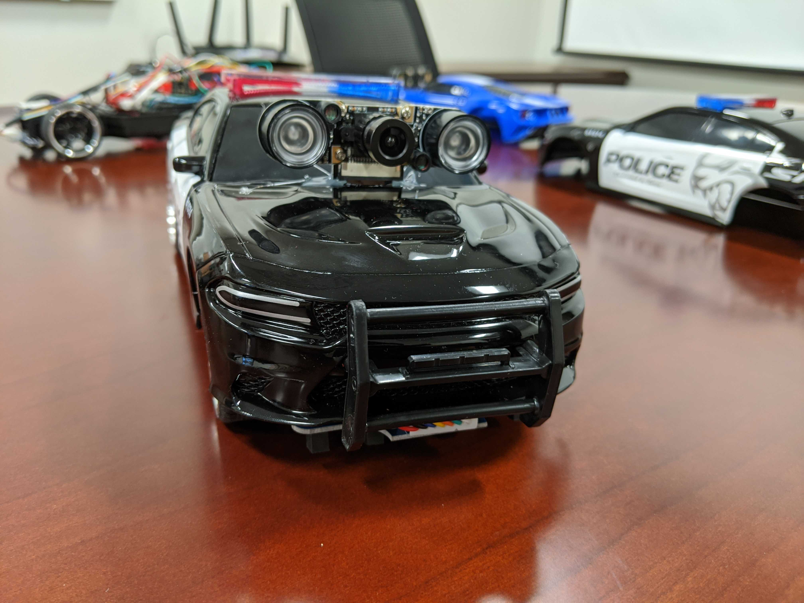

# LTG-RC-Car


Project for creating a line following car using a PID AI to control the movement, speed, and steering of RC Car. This project uses the Raspberry Pi Zero with brushed DC motors for both steering and forward movement.
<br>


### Hardware
This is the fritzing diagram of our car! More details to come soon!

### Installing the Software
For instructions on how to connect the raspberry pi to your network and install Raspbian Buster, follow these instructions, 
[Setup Raspberry PI](https://desertbot.io/blog/headless-pi-zero-w-wifi-setup-windows)

To use download and run the scripts within this repo, you must first clone the repo with the command
```
git clone https://github.com/andersonmolter1/LTG-RC-Car-AI/
```
To run the installation script run this chmod command to run the .sh script.
```
chmod u=rwx ./LTG-RC-Car/Setup/Install.sh
```
```
./LTG-RC-Car/Setup/Install.sh
```
## How to run? 
To run the AI to follow a line. Enter the command below in the terminal.
```
python3 LTG-RC-Car\AI_Driver\main.py
```
## Error? What's an Error?

One concept you will hear me talk about a lot in this tutorial is the idea of error. Error is going to refer to how far left or right the car is relative to the middle of the track.
In the simulation in this repo, the cars have 5 trackers on the front of the car that will be looking for where the car is on the track. We will talk about how they do this later in this tutorial. For now, keep in mind that if the car is not in the middle of the track or is swaying to one side of the track, the car will have a higher error. If the car is in the middle of the track, the car will have no error. 

## PID (Proportional-Integral-Derivative) Controller

Control of this car is going to use a PID Controller Model below. The variable "error" will be defined by how far left or right the car is angled relative to the line the car is following. We will be calculating our error with the following logic.

    0 0 0 0 1 ==> Error = 4
    0 0 0 1 1 ==> Error = 3
    0 0 0 1 0 ==> Error = 2
    0 0 1 1 0 ==> Error = 1
    0 0 1 0 0 ==> Error = 0
    0 1 1 0 0 ==> Error = -1
    0 1 0 0 0 ==> Error = -2
    1 1 0 0 0 ==> Error = -3
    1 0 0 0 0 ==> Error = -4

A 1 in this visualization means that that sensor is currently interacting with the box collider that is in the middle of the track. As you can see, 2 trackers can be interacting with that collider at the same time giving us a greater level of accurary when seeing where on the track the car currently is.

The range of motor control we will be using for both steering and forward movement will be within the range of 0-100, where 100 will be the furthest we can turn the car left or right and 0 will have no steering (straight). This range is derived from the motor capability to turn and is standard to this motor type. If we give the motor values outside this range we will
recieve runtime errors from the scripts used to move the car. 

![\Large \alpha _{error} = (J_P\vert_{J_{P=25}}error) - (J_D\vert_{J_{D=0}}\frac{d}{dt}error) - (J_I\vert_{J_{I=0}}\sum_{n=0}^{k\vert_{k=v.len}}v\vert_{v=v[]})](https://latex.codecogs.com/gif.latex?%5CLarge%20%5Calpha%20_%7Berror%7D%20%3D%20%28J_P%5Cvert_%7BJ_%7BP%3D25%7D%7Derror%29%20-%20%28J_D%5Cvert_%7BJ_%7BD%3D0%7D%7D%5Cfrac%7Bd%7D%7Bdt%7Derror%29%20-%20%28J_I%5Cvert_%7BJ_%7BI%3D0%7D%7D%5Csum_%7Bn%3D0%7D%5E%7Bk%5Cvert_%7Bk%3Dv.len%7D%7Dv%5Cvert_%7Bv%3Dv%5B%5D%7D%29)

### P (Proportion)
 <br>
This section of the model will be determining the initial amount of steering to be applied depedent on the amount of error off the line the car is experiencing. We will start with this variable at 25 to account for the 4 errors on each side of the line that can occur. 
### I (Integral)
![\Large (J_I\sum_{n=0}^{k\vert_{k=v.len}}v\vert_{v=v[]})](https://latex.codecogs.com/gif.latex?%28J_I%5Csum_%7Bn%3D0%7D%5E%7Bk%5Cvert_%7Bk%3Dv.len%7D%7Dv%5Cvert_%7Bv%3Dv%5B%5D%7D%29) <br>
This section of the model will take into consideration all of the previous errors and add them up. If the summation of these errors is not 0, then this section will smooth out the correction to get back on the line. For now the constant will be set to 1. We will figure out the best value of this constant later.
### D (Derivative)
 <br>
This portion of the model calculates the delta between the previous error and the current error and then multiply that by the constant which we will figure out in a later step. For now, it will be set to 0. Once implemented, this should reduce the overshoot effect that can happen when the current error greatly deviates from the last error. 

## Tuning PID Controller

Remember! The correct PID tuning is based on many many factors so don't worry if it takes a while!

### Tuning P
To start the tuning of the PID Controller, we will start with the P value. Make sure all other values are set to 0 but J_P. Then slowly increase this value until the car has a steady oscillation. 

### Tuning D
We then will move on to tuning D or the variable J_D. We want to increase this value until those oscillations are dampened to your liking. 

### Tuning I
We will then move to tuning I or the variable J_I. We want to increase this value until the oscillations are very minute and keep the car in a relatively straight position.

### Helpful Tip!
If you cannot find the tuning that you desire, slow the speed of the car down and then try it again! Oscillation patterns are more common at higher speeds.


## Gallery of Cars 





## Authors

* **Anderson Molter** - (https://github.com/andersonmolter1)
* **Sanjay Sarma** - (https://github.com/sanjayovs)
* PI: Prof. Ramviyas Parasuraman - HeRoLab UGA - (http://hero.uga.edu)

