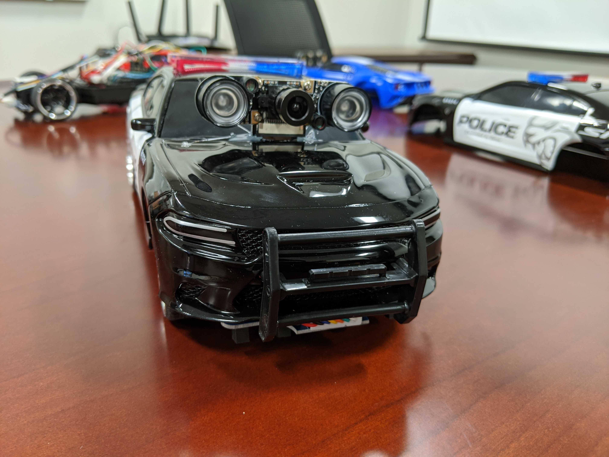

# LTG-RC-Car


Project for creating a line following car using a PID AI to control the movement, speed, and steering of RC Car. This project uses the Raspberry Pi Zero with brushed DC motors for both steering and forward movement.
<br>
<br>


## Software 
### Connecting the Raspberry Pi to your network
Download the *.img file to your local folder on your laptop

Use an imaging tool such as Balena Etcher https://www.balena.io/etcher/ to write the .img file to your SD card by selecting the image and your micro sd card slot. Then select flash!

Once the image is flashed, take out the micro SD card and insert it back into your computer. 

Open up the notepad and hit space once. Then save this file and name the file ssh and click all files in the file type selector. 

Open up notepad again and type in the text below.
```
country=US
ctrl_interface=DIR=/var/run/wpa_supplicant GROUP=netdev
update_config=1

network={
    ssid="herocar"
    psk="herocar"
}
network={
    ssid="Name of Network"
    psk="Password of Network"
}
```
If your network is not listed, add in your network name and password in the open option. Once you have named this file wpa_supplicant.conf and selected the All Files option, you may save this file. 

Drag and drop these files onto your raspberry pi boot drive.

### Creating Your Own Hotspot from Your Windows Laptop

Select the Start  button, then select Settings  > Network & Internet > Mobile hotspot.

For Share my Internet connection from, choose the Internet connection you want to share.

Select Edit > enter a new network name and password > Save.

Turn on Share my Internet connection with other devices.

To connect on the other device, go to the Wi-Fi settings on that device, find your network name, select it, enter the password, and then connect.

### Installing the Software Manually
If you would like to install and setup the software manually, you may use the scripts within this repo for manual installation. For instructions on how to connect the raspberry pi to your network and install Stock Raspbian Buster, follow these instructions, [Setup Raspberry PI](https://desertbot.io/blog/headless-pi-zero-w-wifi-setup-windows) Now that you have installed raspbian and have connected to the Raspberry Pi through your ssh client, you need to run two commands before we start our installation scripts.
```
sudo apt-get update && sudo apt-get upgrade -y && sudo apt-get install git -y
```
To use download and run the scripts within this repo, you must first clone the repo with the command
```
git clone https://github.com/andersonmolter1/LTG-RC-Car/
```
The script we will be running below will prompt ask for what you would like the static ip of the raspberry pi to be, enter it and hit enter and allow the installation to proceed. The command to run this script is below.
```
sudo ./LTG-RC-Car/Setup/Install.sh
```
A prompt will open up with different options for the camera setup after a little while, just hit enter and let the installation proceed.

Once it is over, you will be prompted with a decision if you want to Auto-Start the cam stream when the pi is turned on, hit enter at this option selecting Yes.

## How to run? 
Guess what, the script is already running. All operations that the car requires are now running as a service, which means they run at boot of the pi. If the car cannot be connected to, first check to see if the service named LTG is running with the command below.
```
sudo systemctl status LTG.service
```
If this comes back that is not running, you can re-create the service by running the ServiceMaker.sh script and this will re-create the service. If that fails as well, you can manually run the script for car operations with the command below.
```
python3 LTG-RC-Car\AI_Driver\main.py
```
## Error? What's an Error?

One concept you will hear me talk about a lot in this tutorial is the idea of error. Error is going to refer to how far left or right the car is relative to the middle of the track.
In the simulation in this repo, the cars have 5 trackers on the front of the car that will be looking for where the car is on the track. We will talk about how they do this later in this tutorial. For now, keep in mind that if the car is not in the middle of the track or is swaying to one side of the track, the car will have a higher error. If the car is in the middle of the track, the car will have no error. 

## PID (Proportional-Integral-Derivative) Controller

Control of this car is going to use a PID Controller Model below. The variable "error" will be defined by how far left or right the car is angled relative to the line the car is following. We will be calculating our error with the following logic.

    0 0 0 0 1 ==> Error = 4
    0 0 0 1 1 ==> Error = 3
    0 0 0 1 0 ==> Error = 2
    0 0 1 1 0 ==> Error = 1
    0 0 1 0 0 ==> Error = 0
    0 1 1 0 0 ==> Error = -1
    0 1 0 0 0 ==> Error = -2
    1 1 0 0 0 ==> Error = -3
    1 0 0 0 0 ==> Error = -4

A 1 in this visualization means that that sensor is currently interacting with the box collider that is in the middle of the track. As you can see, 2 trackers can be interacting with that collider at the same time giving us a greater level of accurary when seeing where on the track the car currently is.

The range of motor control we will be using for both steering and forward movement will be within the range of 0-100, where 100 will be the furthest we can turn the car left or right and 0 will have no steering (straight). This range is derived from the motor capability to turn and is standard to this motor type. If we give the motor values outside this range we will
recieve runtime errors from the scripts used to move the car. 

![\Large \alpha _{error} = (J_P\vert_{J_{P=25}}error) - (J_D\vert_{J_{D=0}}\frac{d}{dt}error) - (J_I\vert_{J_{I=0}}\sum_{n=0}^{k\vert_{k=v.len}}v\vert_{v=v[]})](https://latex.codecogs.com/gif.latex?%5CLarge%20%5Calpha%20_%7Berror%7D%20%3D%20%28J_P%5Cvert_%7BJ_%7BP%3D25%7D%7Derror%29%20-%20%28J_D%5Cvert_%7BJ_%7BD%3D0%7D%7D%5Cfrac%7Bd%7D%7Bdt%7Derror%29%20-%20%28J_I%5Cvert_%7BJ_%7BI%3D0%7D%7D%5Csum_%7Bn%3D0%7D%5E%7Bk%5Cvert_%7Bk%3Dv.len%7D%7Dv%5Cvert_%7Bv%3Dv%5B%5D%7D%29)

### P (Proportion)
 <br>
This section of the model will be determining the initial amount of steering to be applied depedent on the amount of error off the line the car is experiencing. We will start with this variable at 25 to account for the 4 errors on each side of the line that can occur. 
### I (Integral)
![\Large (J_I\sum_{n=0}^{k\vert_{k=v.len}}v\vert_{v=v[]})](https://latex.codecogs.com/gif.latex?%28J_I%5Csum_%7Bn%3D0%7D%5E%7Bk%5Cvert_%7Bk%3Dv.len%7D%7Dv%5Cvert_%7Bv%3Dv%5B%5D%7D%29) <br>
This section of the model will take into consideration all of the previous errors and add them up. If the summation of these errors is not 0, then this section will smooth out the correction to get back on the line. For now the constant will be set to 1. We will figure out the best value of this constant later.
### D (Derivative)
 <br>
This portion of the model calculates the delta between the previous error and the current error and then multiply that by the constant which we will figure out in a later step. For now, it will be set to 0. Once implemented, this should reduce the overshoot effect that can happen when the current error greatly deviates from the last error. 

## Tuning PID Controller

Remember! The correct PID tuning is based on many many factors so don't worry if it takes a while!

### Tuning P
To start the tuning of the PID Controller, we will start with the P value. Make sure all other values are set to 0 but J_P. Then slowly increase this value until the car has a steady oscillation. 

### Tuning D
We then will move on to tuning D or the variable J_D. We want to increase this value until those oscillations are dampened to your liking. 

### Tuning I
We will then move to tuning I or the variable J_I. We want to increase this value until the oscillations are very minute and keep the car in a relatively straight position.

## Speed
Speed is the most important value to adjust during the tuning process. The interface allows you to adjust the minimum and maximum speeds. They have a range from 0-200 and if your maximum speed is below your minimum speed, it will automatically make the speed the minimum speed at all times. The car provides more power to the rear motors if the car is turning due to the car having to take on incoming friction with the wheels and their orientation. So the higher the error, the more power the motors will be exerting, resulting in more speed around curves. 
### Tuning Speed
For this, you first want to look at the surface in which the car will be traveling on. If it is a hard surface like a tile or concrete floor, the minimum speed can be much lower than if the surface was foam or carpet. This is because on the harder surfaces, the car has an easier time overcoming intertia at the lower power levels. However, on a foam surface, you need more power all of the time due to the surface constantly providing friction. I recommend starting the max speed at 100 and the minimum speed at 50 and working both closer and closer until you reach an well working speed range. You may need to move the max or min speed up independently in order to find this optimal range. 
### Helpful Tip!
If you cannot find the tuning that you desire, slow the speed of the car down and then try it again! Oscillation patterns are more common at higher speeds.


## Gallery of Cars 


## Authors

* **Anderson Molter** - (https://github.com/andersonmolter1)
* **Sanjay Sarma** - (https://github.com/sanjayovs)
* PI: Prof. Ramviyas Parasuraman - HeRoLab UGA - (http://hero.uga.edu)

